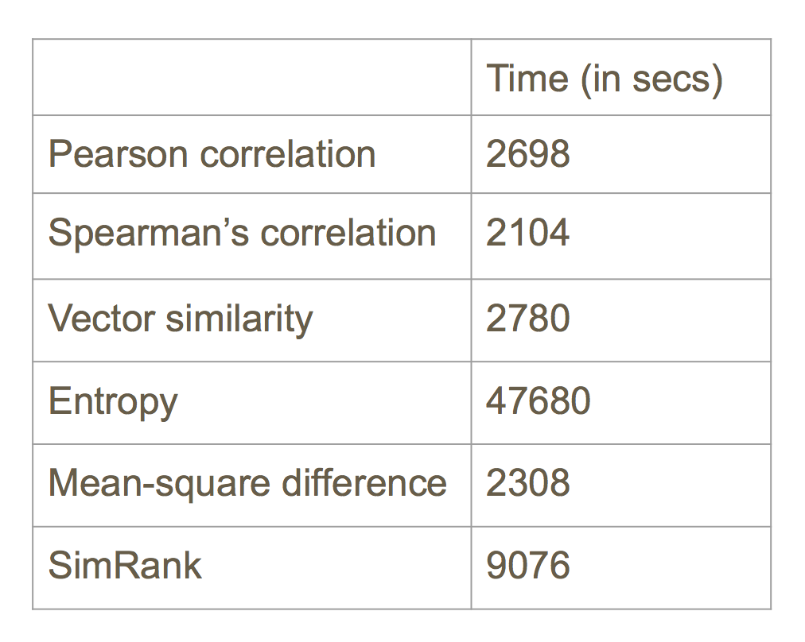
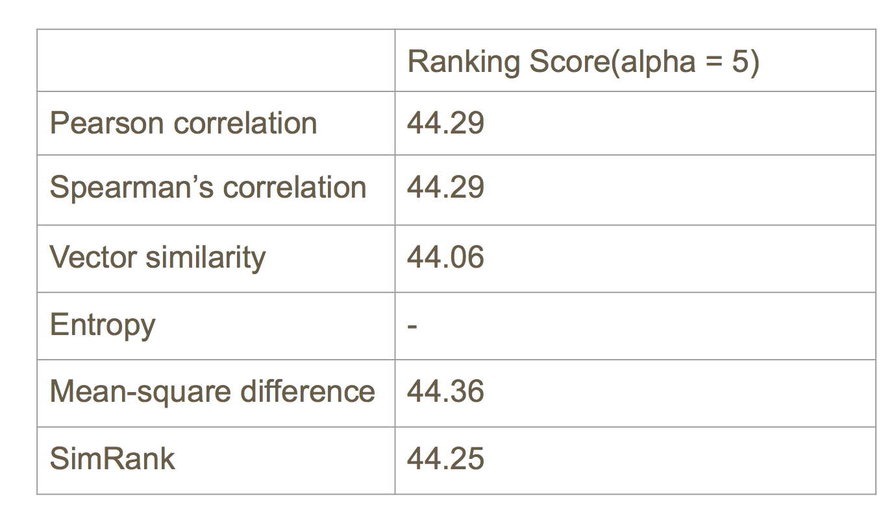
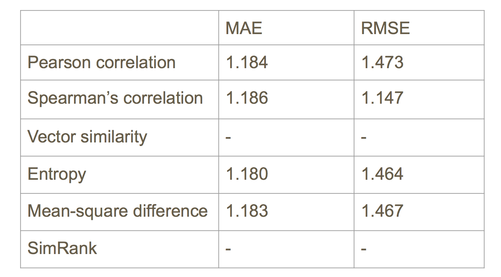

# Spring2018


# Project 3: Algorithm Implementation and Evaluation

----


### [Project Description](doc/)

Term: Spring 2018

+ Project title: Collaborative Filtering and Neighborhood Selection
+ Team Number: 5
+ Team Members: Minzi Keem, Yang He, Yujie Hu, Sile Yang, Chuyuan Zhou
+ Project summary: Our group was tasked with considering different similarity weights, and from there to see whether prediction accuracy improves by using different similarity weights than that based on the Pearson correlation. In addition, we had to figure out whether selecting the best "neighbors" for an active user improves prediction accuracy, since there is evidence that selecting a subset improves accuracy.


### Similarity Weights
We calculated similarity weights for each of the datasets using the Pearson, Spearman, Cosine, MSD, Entropy, and Simrank similarity weights.

### Model-based Algorithm

Since memory-based algorithm is not always as fast and scalable as we expected, especially when we need to generate real-time recommendations on the basis of very large datasets. To achieve these goals, model-based recommendation systems are used.
From a probabilistic perspective, CF can be viewed as calculating the expected value given what we know(Bayes used). Our model-based algorithm are developed using cluster method(EM algorithm) to learn parameters for a model structure with a fixed number of classes. 

We set the group number as 11 and 9 for movie & MS dataset respectively, got the probability of user i in cluster c (A[i,c]); probability of j rated k in cluster c (Gamma). (take movie dataset as example) and evaluated the results through MAE & RMSE. 

There are some improvements we can make in the future to gain a better accuracy for the EM algorithm.

1. Use CV to set the cluster number

2. Run more than once with different initial number & choose results through MLE

3. Change convergence criterion to gain a more accurate prediction.
 


### Memory-based Algorithm
Memory-based algorithm is user-based neighborhood model, using various components for similarity weight.
1. Pearson’s correlation
2. Spearman’s correlation: Pearson / Spearman is the same for Microsoft Dataset (0 & 1 entries)
3. Vector(cosine) similarity: Cosine Vector Similarity method is an “unnormalized” version of Pearson. It works fine for MS data, but since it ignores the “scale” of rating for different users, it does not works well with EachMovie data.
4. Entropy: For each row in sim weights: w(i, j) = max(w(i, )) - w(i, j) / max(w(i, )) - min(w(i, ))
5. SimRank: Only ran SimRank on MS data

Time Used on Sim-Weight Matrices (Movie)  



### Evaluation
For EM dataset, we used the Mean Absolute Error and the Root Mean Square Error. For both values, the smaller the value, the more accurate our predictions are. For MS dataset, which can give us a ordered list of recommendations, we used Rank Scoring Evaluation. 

Memory-Based Algorithm(MS) Evaluation  


Memory-Based Algorithm(Movie)  


### Neighborhood Selection
For the purposes of our neighborhood selection, we tried filtering the data by minimum threshold only, and then by the nearest number of neighbors. For both the EM data and the MS data, we tried a minimum threshold of 0.1, 0.2, 0.3, 0.4, 0.5. We did this filtering by setting all the similarity weights under the desired weights to 0.

We then tried a combined method with a minimum threshold of 0.1 and a number of neighbors at twenty, and then forty. To do this, we found the top twenty and forty similarity weights and filtered out anything that did not fall under that category.

Our results showed that for the Microsoft data, the MAE and RMSE were smallest for Min Abs Corr = 0.1, and Number of Neighbors at 20. Extending the number of neighbors further from 20 or so seemed to decrease the accuracy, though more data points would be needed to confirm that. For the EachMovie data, however, the MAE was smallest for Min Abs Corr = 0.2, and the RMSE was smallest for Min Abs Corr = 0.1, and Number of Neighbors 40. However, the MAE for the Number of Neighbors at 40 was quite small as well, which leads us to believe that the neighborhood selection should be set with a higher number of neighbors, perhaps 50 or 60. More selection can be run to test for this.


### Contribution statement: 

+ Yujie Hu: Focused on model-based algorithm(EM), helped run entropy weight prediction, made slides and gave presentation.
+ Yang He: Focused on memory-based algorithm, coded the algorithm implementations and cleaned up the final repo.
+ Sile Yang: Focused on evaluation part, completed MAE, RMSE, Rank Scoring functions, generated evaluations; Helped run EM & MS similarity and prediction data files.
+ Minzi Keem: Focused on neighborhood selection part, and generating MAE and RMSE on the neighborhoods, helped run cosine weight prediction, contributed to the ppt and created the main readme file.
+ Chuyuan Zhou: Coded EM cross validation, helped run EM prediction, created and contributed to ppt and readme.


Following [suggestions](http://nicercode.github.io/blog/2013-04-05-projects/) by [RICH FITZJOHN](http://nicercode.github.io/about/#Team) (@richfitz). This folder is orgarnized as follows.

```
proj/
├── lib/
├── data/
├── doc/
├── figs/
└── output/
```

Please see each subfolder for a README file.
